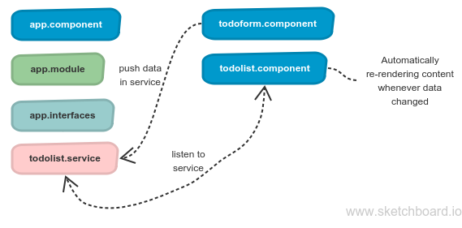

# Angular-RxJS - To-Do list

This project was generated with [Angular CLI](https://github.com/angular/angular-cli) version 6.0.1. You may want to know about how you can [start here](ANGULAR.md) and view [online demo here](https://nguyenkhois.github.io/angular-rxjs-todo-list/dist/).

You may want to view about these things in this project:
* Angular 6.0.2 (ng-template) and RxJS 6.1.0
* Component interaction (@input, services, OnInit, OnDestroy)
* RxJS (observable, observer, subscription -> .subscribe(), .unsubscribe(), next())
* Re-rendering

## Overview

## References
### Guides
* [Angular services](https://angular.io/tutorial/toh-pt4)
* [Building a Todo App with Angular CLI](https://www.sitepoint.com/angular-2-tutorial/)
* [Different ways of unsubscribing from RxJS Observables with Angular](https://blog.codecentric.de/en/2018/01/different-ways-unsubscribing-rxjs-observables-angular/)

### Deployment
* [RxJS 6](https://github.com/ReactiveX/rxjs/blob/master/MIGRATION.md)
* [Angular - The RxJS Library](https://angular.io/guide/rx-library)
* [Angular - Deployment](https://angular.io/guide/deployment)
* [Angular 5 Deployment - Deploy your Angular App](https://coursetro.com/posts/code/112/Angular-5-Deployment---Deploy-your-Angular-App)